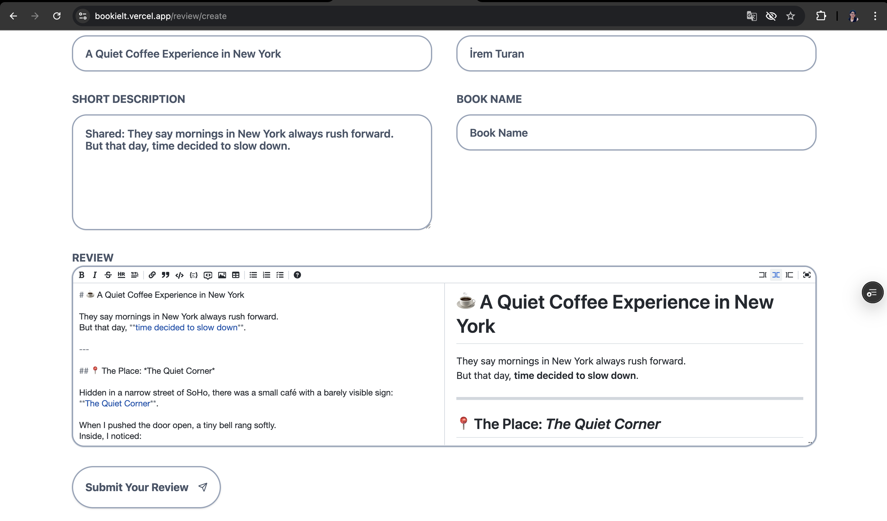

# 📚 Book Review Platform

A modern full-stack web application where users can share their thoughts about books and explore reviews written by others.  

---

#### 🚀 Features

- **Live Content API**: Dynamically displays the latest book reviews using Sanity’s Content API.

- **Review Submission**: Users can submit reviews including title, description, and additional details.

- **View Reviews**: Browse through submitted reviews with filtering options by book name.

- **Review Details Page**: View detailed information by clicking on a specific review.

- **Profile Page**: Click on a user’s name to see all reviews submitted by that user.

- **View Counter**: Tracks views per review to measure engagement instead of using an upvote system.

- **Markdown Editor with Live Preview**: While typing a review in Markdown, users can see a live preview panel on the right side, which instantly renders how the content will appear once published.

- **Search Functionality**  
  
- **Design**: Clean and modern UI built with TailwindCSS and Shadcn UI.

---

#### Project Details

This project allows users to write and read comments about books in an interactive and user-friendly environment.  
By integrating **NextAuth**, users can sign in easily using their **Google account**. Once authenticated, they can submit and manage their own reviews.

The application showcases:

- **Next.js Form** for client-side form submissions  
- **Next After (callback function)** for background tasks  
- **Server Component HMR Cache** for faster development  
- **Partial Prerendering** for improved performance  

Additional tools and libraries used:

- **Markdown-it** for markdown parsing  
- **Zod** for form validation  
- **Sanity** as a headless CMS for content management  

Throughout development, this project helped solidify key concepts such as application structure, routing, rendering strategies, and full-stack development patterns.

---

#### 🛠️ Technologies Used

- TypeScript  
- Next.js 15  
- React 19  
- Shadcn UI  
- TailwindCSS  
- Sanity  
- Headless CMS Architecture  
- Google Authentication (NextAuth)  
- Server-Side Data Fetching & Rendering  

---

**Installation**

Install the project dependencies using npm:

```
npm install
```

**Set Up Environment Variables**

Create a new file named `.env.local` in the root of your project and add the following content:

```
NEXT_PUBLIC_SANITY_PROJECT_ID=
NEXT_PUBLIC_SANITY_DATASET=
NEXT_PUBLIC_SANITY_API_VERSION='vX'SANITY_TOKEN=

AUTH_SECRET=
AUTH_GOOGLE_ID=
AUTH_GOOGLE_SECRET=
```

Replace the placeholder values with your actual Sanity credentials. You can obtain these credentials by signing up & creating a new project on the [Sanity website](https://www.sanity.io/).

#### 📌 Notes

- Authentication is required to submit reviews.
- All content is managed dynamically via Sanity
- Designed with scalability and performance in mind.

#### 🖼️ Preview



